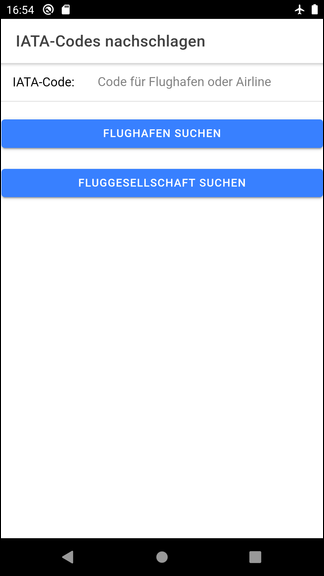

# Ionic app to demonstrate automated tests #

This repository contains an Ionic app which uses Angular and Capacitor.
The app's purpose is it to demonstrate how to write automatic tests for Ionic apps.

The app allows to query for IATA codes (International Air Transport Association),
namely [airport codes](https://en.wikipedia.org/wiki/IATA_airport_code)
and [airline codes](https://en.wikipedia.org/wiki/Airline_codes), but only a few airports
and airlines are actually "stored" (i.e. hard-coded) in the app,
see [class IatadbService](src/app/iatadb.service.ts).

<br>

The author of this app is not related to the IATA in any way.

<br>

----

## Screenshot ##

   

   

<br>

----

## Running the tests ##

Enter the following command to run the tests with the [Karma testrunner](http://karma-runner.github.io/latest/index.html):

```
npm test
```

The unit tests are defined in the files with suffix `.spec.ts` under folder [src/app/](src/app/).

<br>

----

## License ##

See the [LICENSE file](LICENSE.md) for license rights and limitations (BSD 3-Clause License) for the files in this repository.

<br>